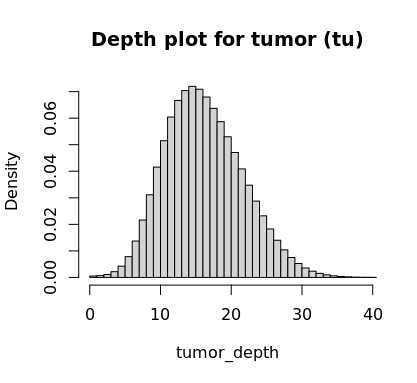
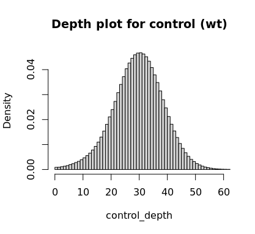

# Cancer-Genomics-HW
## 1.Download reference for Chromozome X GRCh37 assembly in FASTA format from NCBI.
## 2.Index the fasta file.
```bash
bwa index GRCh37_chrX.fasta
samtools faidx GRCh37_chrX.fasta
```
## 3.Align paired end reads for both tumor and control reads using BWA.
```bash
bwa mem GRCh37_chrX.fasta tu.r1.fq.gz tu.r2.fq.gz | samtools view -bT GRCh37_chrX.fasta - > tumor.bam
bwa mem GRCh37_chrX.fasta wt.r1.fq.gz wt.r2.fq.gz | samtools view -bT GRCh37_chrX.fasta - > control.bam
```
## 4.Sort and index resulting BAM files.
```bash
samtools sort -o tumor_sorted.bam tumor.bam
samtools sort -o control_sorted.bam control.bam
samtools index tumor_sorted.bam
samtools index control_sorted.bam
```
## 5.Subset to the region of interest (20 to 40MB).
```bash
samtools view -b tumor_sorted.bam CM000685.1:20000000-40000000 > tumor_subset.bam
samtools view -b control_sorted.bam CM000685.1:20000000-40000000 > control_subset.bam
```
## 5.Remove duplicated reads and index.
(Not sure if necessary, but sounds like a good idea.)
```bash
samtools rmdup tumor_subset.bam deduped_tumor.bam
samtools rmdup control_subset.bam deduped_control.bam
samtools index deduped_tumor.bam
samtools index deduped_control.bam
```
## 5.Compute depth (coverage) and output into files
(Not sure if necessary, but sounds like a good idea.)
```bash
samtools depth deduped_control.bam > deduped_control.coverage
samtools depth deduped_tumor.bam > deduped_tumor.coverage
```
## 6.Load the coverage files in R. And get the the depth column for tumor and control.
```R
tumor_depth=read.table("deduped_tumor.coverage",header=FALSE, sep="\t", na.strings="NA", dec=".", strip.white=TRUE)$V3
control_depth=read.table("deduped_control.coverage",header=FALSE, sep="\t", na.strings="NA", dec=".", strip.white=TRUE)$V3
```
## 7.Plot the depth (histogram) for both tumor and control.
(Note that there are some peaks with extremely high coverage, especially in control, but only for a tiny fraction of bases. I therefore selected X limits in a way for the graph to be nicely readable.)
```R
hist(tumor_depth,breaks = unique(tumor_depth),xlim=c(0, 39),main = "Depth plot for tumor (tu)")
hist(control_depth,breaks = unique(control_depth),xlim=c(0, 60),main = "Depth plot for control (wt)")
```


